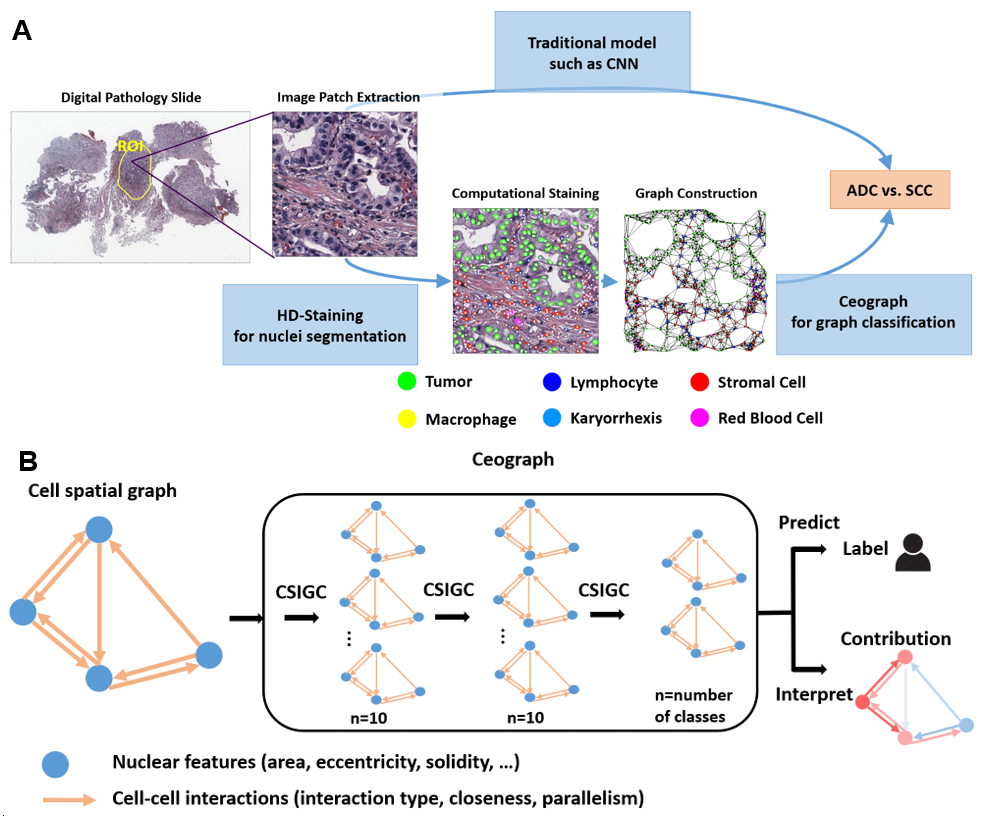

# Ceograph
CEll spatial Organization-based graph convolutional network to integrate cell nuclei morphologies and cell-cell spatial interactions in helping clinical dicision, outcome prediction, and model interpretation. 

# Requirements
* python 3
* torch==1.0.1.post2
* torch-cluster==1.2.4
* torch-geometric==1.0.3
* torch-scatter==1.1.2
* torch-sparse==0.2.5
* torch-vision==0.1.6.dev0
* scikit-learn==0.20.3
* networkx==2.2
* more detailed environment information can be found in __Session Info__ at the bottom of .ipynb files.
